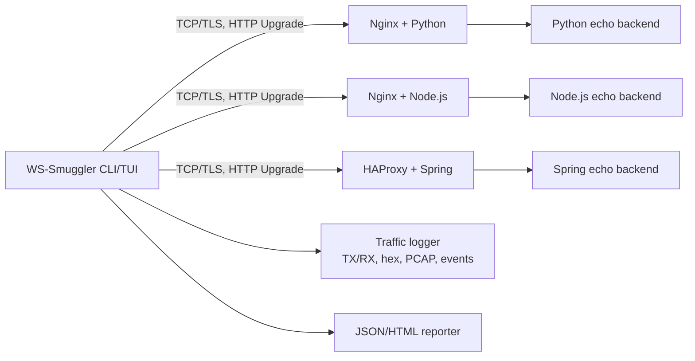
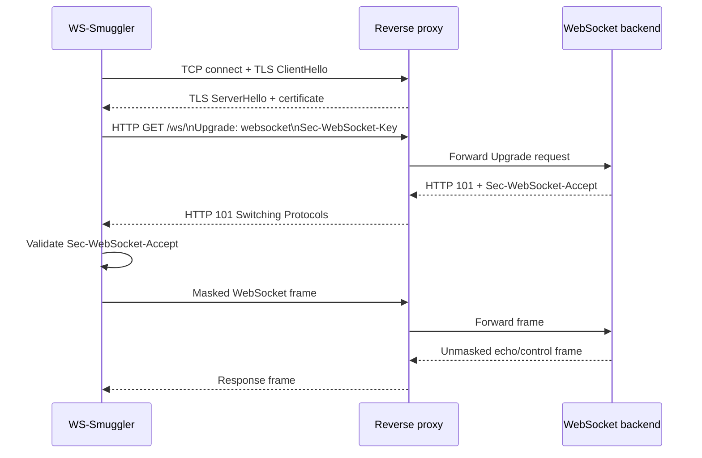

# WS-Smuggler

WS-Smuggler — учебный проект для анализа и демонстрации уязвимостей WebSocket, связанных с десинхронизацией и смешением кадров (frame smuggling). Проект сочетает в себе низкоуровневую работу с TCP/TLS и ручную сборку WebSocket-фреймов по спецификации RFC 6455.

Проект предназначен для лабораторной проверки поведения прокси, балансировщиков и WebSocket-серверов при аномальных заголовках и нестандартных фреймах.

> **Статус документации.** Эта версия README описывает воспроизводимый лабораторный протокол и результаты контрольного запуска от 22 сентября 2026 года. Результаты не являются доказательством уязвимости внешних систем: они относятся только к локальной конфигурации стенда, версиям образов и параметрам запуска, указанным ниже.

## Содержание

- [Модель угроз](#модель-угроз)
- [Архитектура](#архитектура)
- [Ограничения эксперимента и инструмента](#ограничения-эксперимента-и-инструмента)
- [Методика измерений](#методика-измерений)
- [Воспроизводимый эксперимент](#воспроизводимый-эксперимент)
- [Результаты](#результаты)
- [Этические и правовые ограничения](#этические-и-правовые-ограничения)

---
## Архитектура и Структура проекта

Проект спроектирован по модульному принципу. Для обеспечения полного контроля над структурой сетевых пакетов и манипуляции битами кадров (RFC 6455) логика утилиты построена на использовании низкоуровневых системных сокетов.

## Что входит в проект

- низкоуровневое подключение через Python `socket` и `ssl`;
- HTTP Upgrade handshake для WebSocket;
- проверка `Sec-WebSocket-Accept` по RFC 6455;
- сборка кадров вручную через побитовые операции;
- локальный Docker-стенд для демонстрации трафика и проксирования;
- базовые unit-тесты на проверку корректности handshake и frame-builder.

## Модель угроз

### Активы

Исследуются корректность маршрутизации WebSocket-сообщений, согласованность состояния
прокси и backend, а также доступность WebSocket-сервиса. Утилита не предназначена для
получения данных из приложения и не моделирует аутентификацию, авторизацию или бизнес-
логику backend.

### Нарушитель и границы модели

Нарушитель контролирует клиентское соединение и может отправлять произвольные байты
после успешного HTTP Upgrade: изменять `FIN`, `RSV`, `opcode`, маскирование и заявленную
длину payload. В модели присутствует промежуточный reverse proxy и отдельный WebSocket
backend. Предполагается, что нарушитель не изменяет конфигурацию Docker, сертификаты,
код proxy/backend и сетевой трафик между proxy и backend.

Проверяется класс ошибок, при котором proxy и backend по-разному интерпретируют границы
кадра или протокольные поля. Успешное завершение TCP-соединения, закрытие с кодом `1002`
или обычный echo сами по себе не доказывают наличие или отсутствие уязвимости: вывод
делается только по согласованному сравнению наблюдений proxy/backend и raw-трафика.

### Сценарии воздействия

В конфигурации `config/default_payloads.json` выделены baseline/control, desync,
protocol error и fragmentation-сценарии. Desync-кейсы используют завышенную или
заниженную длину и вложенный кадр; protocol-error-кейсы проверяют реакцию на
недопустимый `opcode` и `RSV1`. По умолчанию деструктивные кейсы можно исключить
командой `set safe_mode on`.

## Архитектура



Все три внешних endpoint принимают TLS на `localhost` и портах `8080`, `8081` и
`8082`. Сертификат генерируется контейнером `cert-generator` и передаётся proxy через
именованный Docker volume. Backend-контейнеры доступны только внутри сети `webnet`.

### Sequence diagram: handshake



### Sequence diagram: fuzzing-сценарий

```mermaid
sequenceDiagram
   participant C as WS-Smuggler automated mode
   participant P as Proxy
   participant B as Backend
   C->>C: Load and validate JSON case
   C->>P: New TLS + WebSocket session
   C->>C: Build frame with custom length/RSV/opcode
   C->>P: Send malformed frame and optional padding
   P->>B: Proxy interpretation of bytes
   alt accepted
      B-->>P: Echo/response frame
      P-->>C: response; classify status
   else rejected
      P-->>C: close/protocol error/timeout
   end
   C->>C: Save sent/received bytes, timings and classification
   C->>C: Reconnect before the next case
```

---

## Структура проекта

```text
utility/
├── README.md
├── requirements.txt
├── .gitignore
├── .vscode/
│   └── settings.json
├── src/
│   ├── __init__.py
│   ├── main.py
│   ├── core/
│   │   ├── __init__.py
│   │   ├── connection.py
│   │   ├── frame_builder.py
│   │   ├── frame_parser.py
│   │   └── traffic_logger.py
│   ├── modules/
│   │   ├── __init__.py
│   │   ├── automated.py
│   │   └── manual.py
│   └── ui/
│       ├── __init__.py
│       ├── logger.py
│       ├── reporter.py
│       ├── shell.py
│       └── views.py
├── tests/
│   └── test_frames.py
├── config/
│   └── default_payloads.json
├── dumps/
│   ├── test.hex
│   └── test.pcap
├── reports/
│   └── test.json
├── WebStand/
│   ├── docker-compose.yml
│   ├── cert-generator/
│   │   ├── Dockerfile
│   │   └── generate.sh
│   ├── haproxy-spring/
│   │   ├── Dockerfile
│   │   ├── haproxy.cfg
│   │   ├── pom.xml
│   │   └── src/main/java/com/example/
│   ├── nginx-nodejs/
│   │   ├── Dockerfile
│   │   ├── app.js
│   │   ├── nginx.conf
│   │   └── package.json
│   ├── nginx-python/
│   │   ├── Dockerfile
│   │   ├── app.py
│   │   ├── nginx.conf
│   │   └── requirements.txt
│   └── test.txt
└── venv/                 # локально, не входит в Git
```

### Архитектурные слои

- `src/main.py` — CLI-точка входа и создание интерактивной консоли;
- `src/ui/shell.py` — команды `set`, `connect`, `use`, `run`, `report` и `exit`;
- `src/core/connection.py` — TCP/TLS, HTTP Upgrade и отправка/получение данных;
- `src/core/frame_builder.py` — ручная сборка WebSocket-фреймов;
- `src/core/frame_parser.py` — разбор входящих фреймов и сборка фрагментов;
- `src/modules/manual.py` — ручной режим отправки;
- `src/modules/automated.py` — сценарии Length Desync и Nested Frame Smuggling;
- `src/ui/reporter.py` — экспорт JSON/HTML отчётов;
- `src/core/traffic_logger.py` — raw TX/RX, hex-дампы и PCAP;
- `WebStand/` — изолированный Docker-стенд с прокси и backend-сервисами.

---
## Технологический Стек

* **Язык разработки:** Python 3.11+
* **Сетевой уровень:** `socket`, `ssl`
* **Интерфейс (TUI):** 
  * `rich` — визуальное оформление таблиц, логов и Hex-дампов.
  * `prompt_toolkit` — интерактивный ввод с поддержкой истории и автодополнения.
* **Автоматизация CLI:** `click` / `argparse`

---
## Основные компоненты

### 1. WSConnection

Класс в [src/core/connection.py](src/core/connection.py) отвечает за:

- создание TCP-соединения;
- TLS-обёртку для `wss://`;
- отправку HTTP Upgrade запроса;
- чтение HTTP-ответа;
- валидацию `Sec-WebSocket-Accept`;
- корректное закрытие сокета при ошибках.

### 2. FrameBuilder

Класс в [src/core/frame_builder.py](src/core/frame_builder.py) отвечает за:

- сборку WebSocket frame через побитовые операции;
- поддержку `FIN` и `RSV1-3`;
- поддержу opcode: text, binary, close, ping, pong;
- маскирование payload со стороны клиента;
- параметр `custom_length` для fuzzing и desync-тестов.

### 3. WebStand

Локальный тестовый стенд в [WebStand/docker-compose.yml](WebStand/docker-compose.yml) используется для проверки поведения прокси и серверов в условиях реального сетевого взаимодействия.

---

## Установка и запуск

### 1. Клонирование репозитория и подготовка
```bash
git clone https://github.com/la1n-1wakura/utility.git
cd utility
```

### 2. Подготовка окружения

```bash
python3 -m venv venv
source venv/bin/activate
pip install -r requirements.txt
```

### 3. Запуск unit-тестов

```bash
python3 -m pip install -e ".[dev]"
python3 -m pytest -q tests/test_frames.py
```

### 4. Запуск CLI утилиты

После запуска утилита открывает интерактивную TUI-консоль:

- **Ручной режим** — интерактивная сборка и отправка кадров;
- **Автоматический режим** — запланированные сценарии fuzzing;
- **Запись трафика** — будущая запись сырого обмена в hex/pcap.

Пример запуска:

```bash
python3 src/main.py --host localhost --port 8080 --path /ws/ --ssl --insecure --timeout 5
```

Для запуска ручного режима без меню используется флаг `--manual`.

### Интерактивная консоль

Если запустить программу без `--manual`, открывается постоянная консоль в
стиле инструментов для интерактивного тестирования:

```bash
python3 src/main.py
```

Пример сессии:

```text
ws-smuggler > set host localhost
ws-smuggler > set port 8080
ws-smuggler > set path /ws/
ws-smuggler > show options
ws-smuggler > connect
ws-smuggler > use manual
ws-smuggler > run
ws-smuggler > disconnect
ws-smuggler > exit
```

Основные команды: `help`, `show options`, `set`, `use`, `connect`, `run`,
`disconnect` и `exit`. Параметры TLS задаются так: `set ssl on`, затем
`set insecure on` для локального самоподписанного сертификата или
`set ca_file /path/to/ca.crt` для проверки через собственный CA.

Команда `set` проверяет содержимое параметров: `host` принимает доменное имя,
`localhost` или IP-адрес, `port` должен быть в диапазоне `1-65535`, `path`
начинается с `/`, `timeout` должен быть положительным числом, а `ca_file`
должен указывать на существующий файл. При ошибке значение не изменяется.
Если изменить параметры во время активной сессии, например `set port 8081`,
соединение будет автоматически пересоздано при следующем `connect` или `run`;
ручной `disconnect` для этого не требуется.

Автоматический режим запускается после подключения:

```text
ws-smuggler > use automated
ws-smuggler > connect
ws-smuggler > run
```

Сценарии загружаются из `config/default_payloads.json`. Каждый тест может
задавать `name`, `payload`, `opcode`, `fin`, `mask` и `custom_length`. Для
length desync используется `scenario: "length_desync"`, поле
`declared_length` и необязательный `padding_hex`: так можно проверить как
завышенную, так и заниженную длину. Для nested frame injection используется
`scenario: "nested_frame"`; внутренний кадр задаётся через `inner_payload`.
Для hex-payload используется дополнительное поле `payload_encoding: "hex"`.
Результат каждого сценария отображается в таблице со статусом, количеством
отправленных и полученных байт.

Для проверки `ping` используй `opcode 9`, оставь `FIN` и `Mask` включёнными, а
`custom_length` пустым. После malformed-теста с неверной длиной сервер может
закрыть WebSocket по протоколу; следующий `run` автоматически переподключится.

По умолчанию автоматический запуск показывает краткую сводку. Для подробного
вывода используй:

```text
ws-smuggler > run verbose
```

Этот режим дополнительно показывает hex отправленного кадра, `opcode`, `FIN`,
маскирование и payload ответа. Последние результаты можно повторно открыть
командой `show last` без повторной отправки кадров.

Экспорт отчётов выполняется командами:

```text
ws-smuggler > report json
ws-smuggler > report html
ws-smuggler > report all
```

Файлы сохраняются в `reports/`. JSON содержит метаданные, параметры
подключения, список тестов, сводку и найденные аномалии. HTML-версия содержит
адаптивную таблицу, карточки сводки и фильтрацию результатов.

Каталоги можно изменить в консоли:

```text
ws-smuggler > set reports_dir artifacts/reports
ws-smuggler > set dumps_dir artifacts/dumps
ws-smuggler > set logging on
```

Каталоги создаются автоматически, а существующие отчёты и сессии логирования
не перезаписываются: к имени добавляется суффикс `-2`, `-3` и так далее.

Каждый сценарий запускается в отдельной WebSocket-сессии: если некорректный
кадр приводит к закрытию соединения, следующий тест выполняется после нового
handshake и не наследует состояние предыдущего сценария.

Ответы WebSocket разбираются frame parser: утилита определяет `FIN`, `opcode`,
маскирование и расширенную длину, а также собирает frame из нескольких частей
сетевого чтения.

Входящие frames проходят protocol validation: проверяются opcode, RSV-флаги,
правила control frames, `FIN`, максимальная длина 125 байт и последовательность
fragmentation. Close frame дополнительно разбирается на `close_code` и
`close_reason`. Ping/Pong классифицируются как control frames, а обычные text,
binary и continuation frames — как data frames. Нарушения получают категорию
`protocol_error`.

### Запись сырого трафика

Для включения логирования в интерактивной консоли:

```text
ws-smuggler > set logging on
ws-smuggler > connect
```

Или при запуске CLI:

```bash
python3 src/main.py --host localhost --port 8080 --log-traffic
```

Для каждой сессии в `dumps/` создаются:

- `*.tx.bin` — точные отправленные байты;
- `*.rx.bin` — точные полученные байты;
- `*.hex` — читаемый hex-дамп с направлением и timestamp;
- `*.pcap` — стандартный PCAP с raw-записями сессии.
- `*.events.jsonl` — по одной записи на каждый chunk с `session_id`, timestamp,
  направлением `TX`/`RX` и размером.

PCAP использует link type `USER0`, поскольку в нём сохраняются raw application
chunks, а не искусственно реконструированные Ethernet/IP-заголовки. Открыть
файл можно так:

```bash
wireshark dumps/session-<timestamp>.pcap
```

Такой PCAP предназначен для анализа последовательности raw application chunks
в Wireshark и не является полноценным сетевым захватом TCP/IP. Поэтому Wireshark
может не декодировать его как WebSocket автоматически: link type `USER0` не
содержит Ethernet/IP/TCP-заголовков. Точные направления и timestamps доступны в
hex-дампе и `*.events.jsonl`.

Во время активной сессии пути и идентификатор можно посмотреть в консоли:

```text
ws-smuggler > show logging
```

Эти же `session_id` и `dump_paths` сохраняются в JSON-отчёте.

Параметры подключения:

| Сценарий                      | Команда                                                             |
| Локальный стенд: Nginx + Python | `python3 src/main.py --host localhost --port 8080 --ssl --insecure` |
| Обычный WebSocket             | `python3 src/main.py --host example.com --port 80`                  |
| TLS с проверкой сертификата   | `python3 src/main.py --host example.com --port 443 --ssl`           |
| TLS с собственным CA          | `python3 src/main.py --host localhost --port 8443 --ssl --ca-file WebStand/certs/ca.crt` |
| Лабораторный TLS без проверки | `python3 src/main.py --host localhost --port 8443 --ssl --insecure` |

`--insecure` и `--ca-file` нельзя использовать одновременно. Оба параметра
требуют флаг `--ssl`. Режим `--insecure` предназначен только для локального
стенда с самоподписанным сертификатом.

### 5. Ручная отправка WebSocket-фреймов

После успешного handshake можно оставить соединение открытым и отправлять кадры
через `FrameBuilder` в интерактивном режиме:

```bash
python3 src/main.py --host localhost --port 8080 --path /ws/ --manual --timeout 5
```

В ручном режиме утилита запрашивает payload, opcode, флаги `FIN` и `Mask`, а
также необязательный `custom_length`. Значение `custom_length` позволяет
проверять реакцию прокси и backend на расхождение между заявленной длиной и
фактическим payload. Пустые значения обрабатываются так:

- `Payload` — пустой payload разрешён;
- `Opcode` — по умолчанию `1` (текстовый кадр);
- `FIN` и `Mask` — по умолчанию включены;
- `custom_length` — фактическая длина payload;
- неверные числа и значения `yes/no` запрашиваются повторно.

Для удобного ввода доступны история текущей сессии и автодополнение частых
payload (`hello`, `test`, `ping`, `pong`) и opcode. Для завершения введите
`:quit` вместо payload.

---

## Запуск локального стенда

```bash
docker compose -f WebStand/docker-compose.yml up --build
```

После запуска можно проверить доступность сервисов через порты:

- `8080` — Nginx + Python backend
- `8081` — Nginx + Node.js backend
- `8082` — HAProxy + Spring backend

Интеграционные тесты WebStand запускаются после старта Docker Compose:

```bash
python3 -m pytest -m integration -q
```

Тесты проверяют TLS handshake, статус `101`, text echo и корректный Close-фрейм
для всех трёх портов. Если стенд не запущен, соответствующий тест пропускается
с сообщением, содержащим адрес и порт проблемного сервиса.

Если `pytest` не установлен, команда завершится сообщением `No module named
pytest`; в этом случае сначала выполните `python3 -m pip install -e ".[dev]"`.

## Ограничения эксперимента и инструмента

* Стенд локальный и изолирован Docker-сетью; результаты нельзя переносить на
   произвольные версии Nginx, HAProxy, Python, Node.js или Spring без повторного
   запуска.
* Образы `nginx:alpine` и `haproxy:latest` не закреплены по digest, поэтому для
   строгой научной воспроизводимости следует сохранить вывод `docker image inspect`
   и зафиксировать версии образов.
* Backend — минимальные echo-сервисы без реальной бизнес-логики, cookies,
   авторизации, балансировки и конкурирующих клиентов. Проверяется только один
   клиентский поток и один proxy на endpoint.
* Инструмент работает с TCP/TLS и WebSocket-фреймами, но не реконструирует
   полноценный TCP/IP capture: PCAP использует `USER0` и содержит raw application
   chunks. Для анализа порядка байтов необходимо использовать `.hex`, `.events.jsonl`
   и `.tx.bin`/`.rx.bin`.
* `custom_length` намеренно создаёт неполные или лишние байты; поведение при этом
   может зависеть от таймаутов, размера TCP-чтения и реализации proxy. Нельзя
   интерпретировать единичный `timeout` как подтверждение smuggling.
* TLS запускается с `--insecure` только потому, что сертификат стенда
   самоподписанный. Этот режим запрещён для реальных систем.
* Реализация не измеряет CPU, память, пропускную способность и задержку между
   proxy и backend. Сохраняются wall-clock времена handshake/response и размеры
   TX/RX, поэтому это функциональная, а не нагрузочная методика.

## Методика измерений

1. Установить зависимости и запустить Compose из корня репозитория.
2. Дождаться healthcheck `cert-generator`, проверить `docker compose ps` и
    сохранить версии: `docker compose images`.
3. Для каждого target (`8080`, `8081`, `8082`) выполнить baseline-кейсы
    `text_echo`, `binary_echo`, `ping_pong`; затем выполнить desync и
    protocol-error группы. Каждый кейс запускается в новой WebSocket-сессии.
4. Запускать с одинаковыми `path=/ws/`, timeout и TLS-параметрами. Для локального
    стенда используется `--ssl --insecure`; случайные masking keys не являются
    экспериментальным фактором и сохраняются в hex-логе.
5. Включить `set logging on` или `--log-traffic`. Для каждого кейса фиксируются
    `experiment_id`, target, ожидаемый/фактический статус, sent/received bytes,
    handshake duration, response-wait duration, timestamps, error/close code и
    `matches_expected`.
6. Повторить каждый кейс минимум три раза при подготовке итоговой защиты; в отчёте
    указывать число повторов, commit, digest образов и полную команду. В текущем
    контрольном отчёте зафиксирован один прогон, поэтому он показывает наблюдение,
    а не статистически устойчивую оценку.

Команды для воспроизведения полного цикла:

```bash
docker compose -f WebStand/docker-compose.yml up --build -d
docker compose -f WebStand/docker-compose.yml ps
python3 -m pip install -e ".[dev]"
python3 -m pytest -m integration -q
python3 src/main.py --host localhost --port 8080 --path /ws/ --ssl --insecure --log-traffic
# В TUI: set target_id nginx-python; use automated; run group safe; report all
docker compose -f WebStand/docker-compose.yml down
```

Для воспроизведения конкретного кейса в TUI используйте, например, `run invalid_rsv`
или `run category desync`. Перед деструктивными группами проверьте, что target —
локальный Docker endpoint.

## Ожидаемые результаты

| Группа | Ожидаемое корректное поведение |
|---|---|
| baseline | `101`, echo с префиксом `Эхо:`, корректный opcode/payload |
| control | ответ Pong (`opcode=10`) на Ping (`opcode=9`) |
| desync | закрытие/`protocol_error`/timeout либо явно зафиксированное расхождение; неожиданное принятие trailing bytes требует анализа raw-лога |
| protocol_error | закрытие соединения или protocol error, обычно close code `1002` |
| fragmentation | буферизация до завершения либо корректное отклонение |

## Результаты контрольного запуска

Дата запуска: `2026-09-22`, target: `localhost:8080`, путь: `/ws/`, TLS: включён,
проверка сертификата отключена (`--ssl --insecure`), режим: automated, число
кейсов: 6. Исходный файл: `reports/ws-smuggler-report.json`. Полный запуск был
выполнен командой:

```bash
python3 src/main.py --host 127.0.0.1 --port 8080 --path /ws/ --ssl --insecure
```

В отчёте зафиксировано: `responses=0`, `anomalies=6`. Это не означает, что все
шесть кейсов являются уязвимостью: пять кейсов завершились закрытием соединения с
close frame (`opcode=8`), что совместимо с защитным отклонением malformed frame;
`text_echo` завершился ошибкой чтения полного кадра. Причину следует проверять по
raw-дампам и версии стенда.

| Стек | Endpoint | Результат smoke/integration | Результат fuzzing в сохранённом отчёте |
|---|---:|---|---|
| Nginx + Python | `8080` | контрольный запуск: `502 Bad Gateway` при handshake; backend не дал ожидаемый `101` | 6 аномалий в сохранённом отчёте: `text_echo` error, остальные 5 — close |
| Nginx + Node.js | `8081` | контрольный запуск: `502 Bad Gateway` при handshake; backend не дал ожидаемый `101` | в текущем `reports/` не зафиксирован |
| HAProxy + Spring | `8082` | требуется отдельный прогон и отчёт | в текущем `reports/` не зафиксирован |

Таким образом, реальные результаты для `8081` и `8082` пока **не заявляются** как
полученные. Для закрытия экспериментальной матрицы повторите тот же прогон для
каждого порта, изменив `--port`, и сохраните три независимых JSON-отчёта. Это
предотвращает подмену отсутствующих измерений ожидаемыми значениями.

## Этические и правовые ограничения

WS-Smuggler формирует специально некорректные сетевые данные и потенциально может
нарушить доступность WebSocket-сервиса. Запуск разрешён только на собственном
стенде или при явно оформленном письменном разрешении владельца системы. Нельзя
сканировать публичные адреса, обходить авторизацию, отправлять payload с данными
пользователей или сохранять чужие секреты в отчётах и дампах.

Для диплома рекомендуется использовать только Docker-стенд из этого репозитория,
обезличенные payload и локальный интерфейс loopback. Перед публикацией отчётов
удалите IP, cookies, токены, ключи и содержимое, не относящееся к эксперименту.
Соблюдайте применимое законодательство, правила провайдера и политику ответственного
раскрытия. Автор проекта не предоставляет разрешение на тестирование сторонних
систем и не принимает на себя ответственность за несанкционированное применение.

Автоматическая матрица хранится в `config/default_payloads.json`. Каждый кейс
имеет стабильный `experiment_id`, ожидаемый статус и список targets с
`proxy_id`/`backend_id`. В интерактивной консоли можно воспроизвести один кейс:

```text
ws-smuggler > set host localhost
ws-smuggler > set port 8080
ws-smuggler > set ssl on
ws-smuggler > set insecure on
ws-smuggler > set target_id nginx-python
ws-smuggler > use automated
ws-smuggler > run invalid_rsv
ws-smuggler > report json
```

JSON-отчёт содержит `experiment_id`, target, ожидаемый `expected_status`,
фактический `actual_status` и `matches_expected`. Допустимые фактические
классы: `response`, `closed`, `timeout`, `protocol_error`, `error`.

Конфигурация автоматического режима валидируется до подключения в два этапа:
сначала структура файла проверяется по JSON Schema из
`config/payloads.schema.json` (некорректный тип, отсутствующее обязательное
поле или неизвестный `scenario` отклоняются сразу с указанием пути до
проблемного узла), затем выполняются семантические проверки — уникальность
`experiment_id`, согласованность `groups`, обязательные поля выбранного
`scenario` и корректность `hex`-payload. Для каждого кейса обязательны
`experiment_id`, `name`, `category`, `expected_status` и `expected_response`;
специальные сценарии также проверяют свои поля. Если в конфигурации указан
необязательный список `categories`, то `category` каждого кейса обязана
входить в этот список — так typo в имени категории обнаруживается до
подключения. Новый сценарий добавляется в `config/default_payloads.json` без
изменения Python-кода: достаточно добавить объект в `cases` (и, при
необходимости, включить его `experiment_id` в `groups`).

Доступны фильтры автоматического запуска:

```text
ws-smuggler > run text_echo
ws-smuggler > run group desync
ws-smuggler > run category protocol_error
ws-smuggler > set max_tests 3
ws-smuggler > set safe_mode on
ws-smuggler > run
```

`safe_mode` исключает сценарии с `destructive: true`, а `max_tests` ограничивает
количество запускаемых кейсов.

Каждый результат также содержит `started_at`, `ended_at`, `duration_ms`,
`handshake_duration_ms`, `response_wait_duration_ms`, `sent` и `received`.
В секции `summary` сохраняются распределение статусов, суммарные байты,
количество timeout и protocol close, успешные ответы и `anomaly_percentage`.

Каждый экспорт получает уникальный `run_id`. JSON и HTML сохраняются парой с
именем, содержащим дату, конфигурацию и run ID, поэтому предыдущие запуски не
перезаписываются. Архив можно просмотреть из консоли:

```text
ws-smuggler > show reports
```

Два JSON-отчёта сравниваются командой:

```text
ws-smuggler > compare reports/ws-smuggler-<run-a>.json reports/ws-smuggler-<run-b>.json
```

Сравнение показывает новые, исчезнувшие и изменившиеся аномалии, а также
изменившиеся summary-метрики. HTML-отчёт содержит ссылку на исходный JSON.

---

## Текущие цели проекта

Проект направлен на исследование следующих классов уязвимостей:

- WebSocket Frame Smuggling;
- десинхронизация между прокси и backend;
- аномальная длина кадров;
- обработка маскированных и немаскированных сообщений;
- дифференциация корректного и аномального `Sec-WebSocket-Accept`.

---

## Функциональные возможности

* **Низкоуровневый конструктор (Manual Mode):** Возможность вручную выставлять биты `FIN`, `Opcode`, управлять флагом маскирования (`Mask`), а также намеренно искажать длину Payload в заголовке кадра для проверки реакций прокси-серверов.
* **Автоматизированные сценарии (Automated Mode):** Готовые тест-кейсы для симуляции атак десинхронизации (например, внедрение скрытого кадра внутрь Payload легитимного сообщения).
* **Контроль трафика:** Логирование отправленных аномальных байт в формате Hex-дампа и экспорт сессий в `.pcap` для последующего анализа в Wireshark.
* **Отчетность:** Выгрузка структурированных отчетов в формате JSON/HTML для интеграции с процессами DevSecOps.
---

## Ограничения и безопасность

Данный проект используется исключительно в лабораторных и учебных целях для исследования сетевой безопасности. Не используйте его против систем, к которым у вас нет права доступа.

---

## Disclaimer

Данный проект создан в рамках исследовательской и образовательной работы и предназначен для легального аудита сетевой безопасности и анализа протоколов.

---

## Новые возможности

1. **Расширяемая JSON схема** для автоматического режима:
   - Формальная валидация конфигурационных файлов через JSON Schema Draft 2020-12
   - Обязательные поля с описанием (`experiment_id`, `description`, `category`, `targets`)
   - Условные требования для разных сценариев тестирования
   - Поддержка запуска по имени (run by name), групповых запусков и категорий
   - Ограничение максимального числа тестов через `max_tests`
   - Безопасный режим (safe mode) пропускает деструктивные тесты

2. **Автоматизированная проверка качества через GitHub Actions**:
   - Матричное тестирование на Python 3.11, 3.12 и 3.13
   - Проверка компиляции Python файлов и JSON конфигураций
   - Статический анализ кода с Ruff (замена flake8/isort/black)
   - Запуск всех unit и интеграционных тестов через pytest
   - Проверка изменений в репозитории (`git diff` перед публикацией)
   - Проверка сборки Docker Compose окружения

3. **Современный инструментарий**:
   - Ruff 0.16.8 для быстрого линтинга и форматирования
   - Конфигурация через `pyproject.toml`
   - GitHub Actions workflow для Continuous Integration

---
## Установка как пакет

WS-Smuggler можно установить как пакет Python, что позволяет запускать его из любого места без необходимости клонирования репозитория.

### Установка из исходников

```bash
# Клонирование репозитория
git clone https://github.com/la1n-1wakura/ws-smuggler.git
cd ws-smuggler

# Установка пакета
pip install .
```

### Установка из PyPI (будущая версия)

```bash
pip install ws-smuggler
```

После установки команда `ws-smuggler` будет доступна в PATH:

```bash
ws-smuggler --help
ws-smuggler --host localhost --port 8080 --ssl --insecure
```

### Установка для разработки

```bash
git clone https://github.com/la1n-1wakura/ws-smuggler.git
cd ws-smuggler
pip install -e ".[dev]"
```

Опция `[dev]` устанавливает дополнительные зависимости для разработки (pytest, ruff).

---
## Установка и запуск (разработка)
